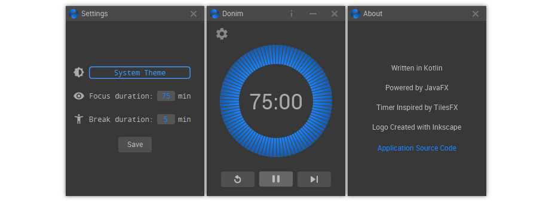

[][1]
[][2]

  <picture>
    <source media="(prefers-color-scheme: dark)" srcset="https://raw.githubusercontent.com/mahozad/donim/master/raw/readme-header-on-dark.svg">
    
  </picture>

##

### The name
"Donim" is composed of two Persian words: "do" meaning *two* and "nim" meaning *half*.  
So it basically means something that consists of two parts (or two halves).

### The logo
It is inspired from the well-known [yin and yang][3] symbol[^1].

### Screenshots

[^1]: I found a striking similarity between Donim logo and [this][4] or [this][5] (notice the colors)!

[1]: https://travis-ci.org/mahozad/donim
[2]: https://coveralls.io/github/mahozad/donim?branch=master
[3]: https://en.wikipedia.org/wiki/Yin_and_yang
[4]: https://marketplace.atlassian.com/apps/1221739/squadcast-for-jira-server?hosting=server&tab=overview
[5]: https://play.google.com/store/apps/details?id=com.automattic.simplenote&hl=en&gl=US
